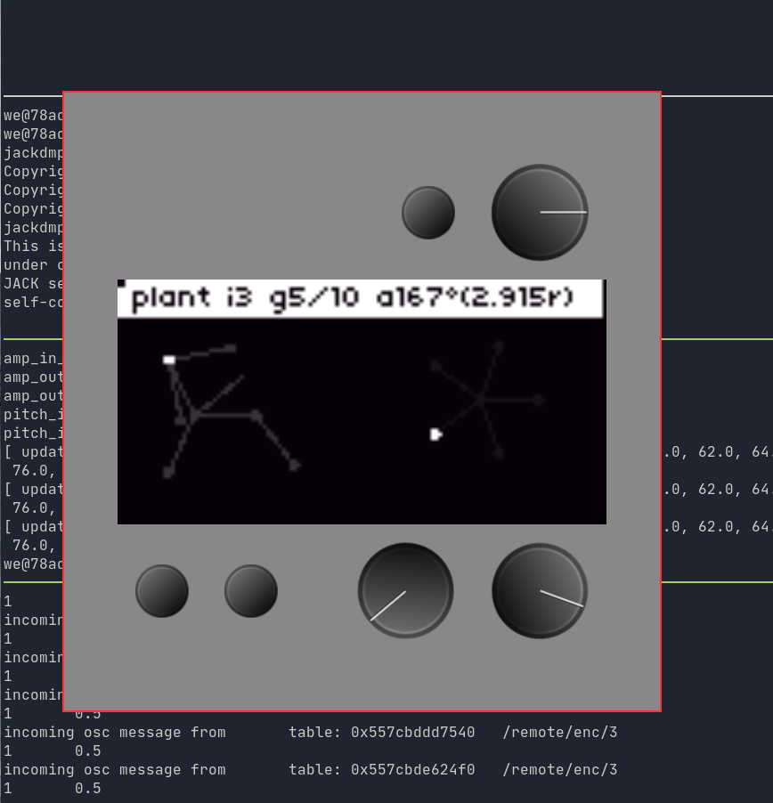

# Norns Docker UI

This is a simple GUI frontend for the [norns docker environment](https://github.com/winder/norns-dev). It displays the virtual norns UI using the screenshot server and exposes OSC controls.

## local configuration

Install Java. A recent version should work.

RUn the norns docker environment to provide:
* screenshot server at http://localhost:8889
* OSC listener at http://localhost:10111

## Usage

Build: `./gradlew build`
Run: `./gradlew run`

